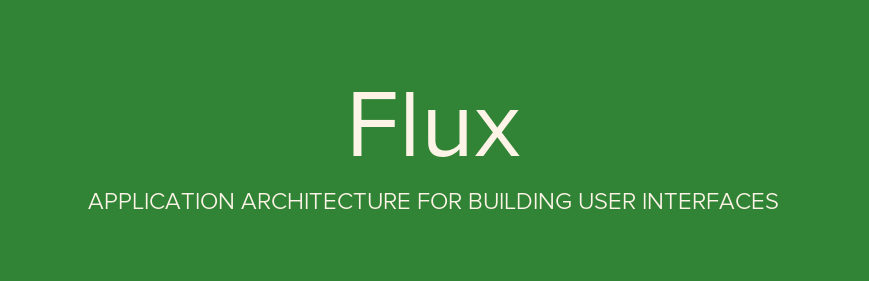
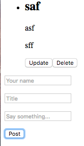

This demo helps you learn [Flux architecture](https://facebook.github.io/flux/). It is inspired by Andrew Ray's great article [Flux For Stupid People](http://blog.andrewray.me/flux-for-stupid-people/).

## What is Flux?

Flux, invented by Facebook, is an architecture pattern for building client-side web applications.

It is similar to MVC architecture, but Flux's concept is [much clearer](http://www.infoq.com/news/2014/05/facebook-mvc-flux) than MVC's, and easier to learn.



## How to Play?

Install the demo.

```bash
$ git clone https://github.com/alanlong9278/react_flux_example.git
$ cd react_flux_example && npm install
$ npm start
```

Visit http://127.0.0.1:8080 with your browser.



You should see a button. Click it. That's all.

## Core Concepts

According to Flux, an application should be divided into four parts.

> - **Views**: the UI layer
> - **Actions**: messages sent from Views (e.g. mouseClick)
> - **Dispatcher**: a place receiving actions, and calling callbacks
> - **Stores**: a place managing the Application's state, and reminding Views to update


The key feature of the Flux archetecture is "one way" (unidirectional) data flow.

> 1. User interacts with Views
> 1. Views propagate an Action triggered by user
> 1. Dispatcher receives the Action and updates the Store
> 1. Store emits a "change" event
> 1. Views respond to the "change" event and update itself

Don't get it? Take it easy. I will give you the details soon.

## License

MIT
